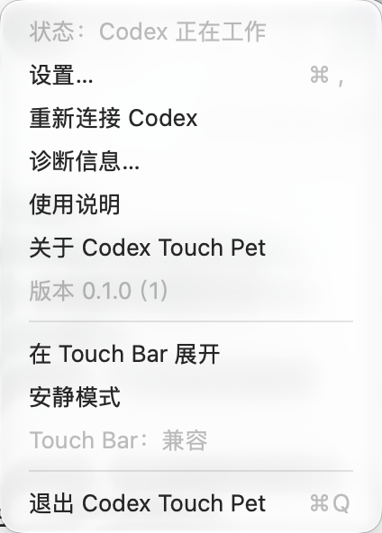
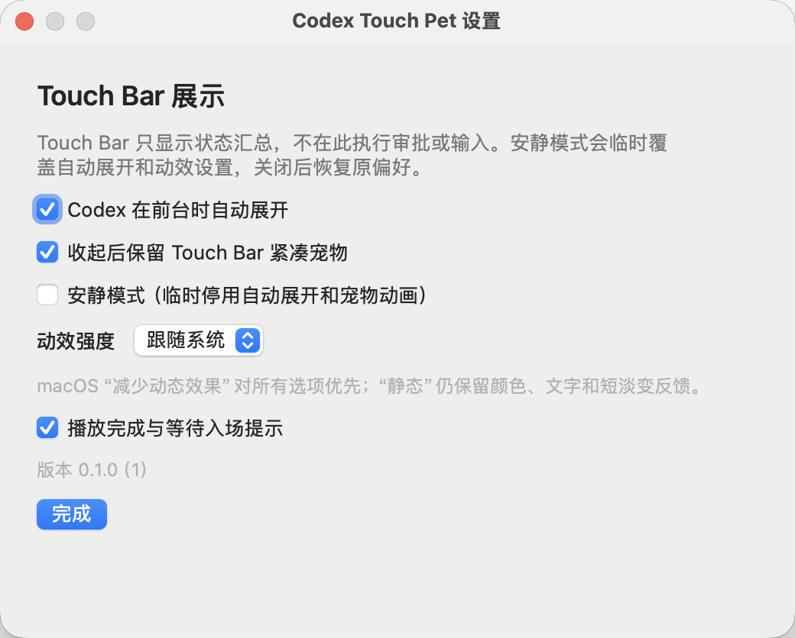
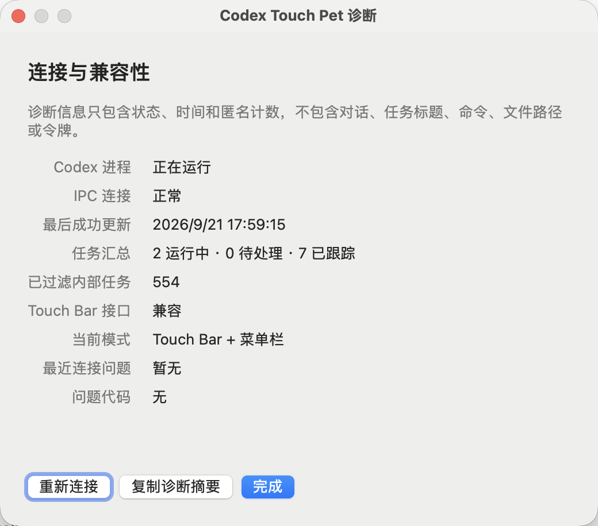

# codex-touchbar-poc

Codex 状态宠物在实体 MacBook Touch Bar 上的可行性验证。

## 当前状态

- Touch Bar 真机展示：已通过。
- 退出和 Control Strip 恢复：已通过。
- Codex `active → idle/completed` 实时状态：已通过。
- Control Strip 宠物常驻，Codex 前台时自动展开完整状态。
- 多个顶层任务以状态胶囊并排展示，可手动横向滑动；不自动轮播，不显示 `1/2`、`2/2` 分页编号。
- 点击任务胶囊使用完整会话 ID 精确跳转到 Codex 对应任务；缩略标题只用于显示。
- 工具活动只作短暂辅助信息，不覆盖主工作状态。
- 全部语义状态已接入 6 帧狐狸动画；每组使用同一空间变换、统一参考尺寸和基线，避免状态切换或帧间忽大忽小。
- 应用使用用户级文件锁保证单实例运行，重复启动不会叠加 Touch Bar、动画计时器或 IPC 订阅。
- IPC 断线后会先保留最后状态并显示重连，超过宽限期后明确标记状态过期。
- 菜单栏提供手动重连和隐私安全的诊断摘要，不包含对话正文、任务标题、命令或文件路径。
- 产品设计：见 `PRODUCT_DESIGN.md`。

## 界面预览

### 菜单栏控制中心



### 设置与诊断

| 设置 | 连接与兼容性诊断 |
|---|---|
|  |  |

Touch Bar 本体无法通过 macOS 屏幕截图 API 捕获，真机效果需使用实体设备拍摄。

## 构建与运行

```bash
make clean all
make probe
./touchbar-pet-poc 45
python3 codex_status_probe.py
python3 desktop_status_probe.py 10
make test-app app
```

`touchbar-pet-poc` 会在设定时间后自动清理。也可以按 `Ctrl-C` 提前退出。

正式应用构建在 `.build/app/Codex Touch Pet.app`。它不会自动安装或设置开机启动。

生成可交付的 macOS App 包（包含版本信息、README 和开源说明）：

```bash
make package
```

产物位于 `.build/package/Codex Touch Pet.app`。这是一个经过 ad-hoc 签名的本地测试包；首次运行时可能需要在系统设置中允许打开。

## 菜单栏设置与状态颜色

- 设置、使用说明、版本和开源说明从顶部菜单栏入口访问，不占用 Touch Bar 空间。
- 设置会持久保存：可分别控制前台自动展开、紧凑宠物常驻、安静模式、动效强度和完成/等待提示。
- 动效默认跟随 macOS“减少动态效果”；安静模式临时停用自动展开和宠物动画，不会改写其他偏好。
- 空闲使用中性颜色；运行中使用蓝色；正在连接使用琥珀色；未连接使用靛紫色；已停止使用灰色；只有失败或系统异常使用红色。
- Touch Bar 左侧固定显示宠物与主状态，中间是可横向滑动的任务胶囊，右侧固定显示连接状态。
- 任务胶囊通过背景色、细边框和文字标签表达工作中、待确认、待回复、已完成、失败和已停止，不另加状态图标。
- Codex 当前选中会话尚无稳定的外部状态源，因此暂不显示“当前任务”高亮，也不用最近更新时间伪判断。

## 开源说明

源码仓库：<https://github.com/sj930211/codex-touch-pet>

许可证目前仍待项目所有者确认，详见 `NOTICE.txt`。在许可证明确前，不应把仓库内容视为已授予公开复制、修改或分发许可。

## 注意

本项目使用 macOS 和 Codex Desktop 的私有接口，只适合实验、自用或有明确兼容性策略的直接分发产品。不要把当前 PoC 当作稳定公开 API 示例。
